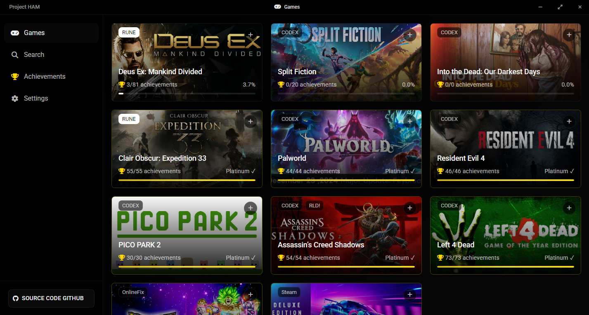

# 🎮 Hydra Achievements Manager

Um gerenciador de conquistas. Gerencie e acompanhe suas conquistas de jogos do Hydra <3



## ✨ Funcionalidades

- 🎯 Visualize e gerencie conquistas de qualquer jogo do Hydra
- 🎨 Interface com tema escuro elegante
- 🔍 Pesquise e filtre conquistas
- ⏰ Suporte a timestamp personalizado para cada conquista
- 📊 Acompanhamento de progresso dos seus jogos
- 🔐 Armazenamento seguro da chave API
- 📁 Diretório de saída personalizável

## 🚀 Começando

### Pré-requisitos

- Node.js (v14 ou superior)
- npm (v6 ou superior)
- Uma chave API Steam (obtenha [aqui](https://steamcommunity.com/dev/apikey))

### Instalação

1. Clone este repositório
```bash
git clone https://github.com/Levynsk/hydra-achievements-manager
cd hydra-achievements-manager
```

2. Instale as dependências
```bash
npm install
```

3. Inicie a aplicação
```bash
npm start
```

### Compilação

Para criar um pacote distribuível:

```bash
npm run build
```

Isso criará executáveis na pasta `dist`.

## 🛠️ Configuração

1. Abra o aplicativo
2. Vá para a aba Configurações
3. Insira sua chave API Steam
4. Configure seu diretório de saída (padrão: C:/Users/Public/Documents/Steam/RUNE)
5. Escolha seu tema preferido

## 🤝 Contribuindo

Contribuições, issues e pedidos de funcionalidades são bem-vindos! Sinta-se à vontade para verificar a [página de issues](https://github.com/yourusername/hydra-achievements-manager/issues).

## 📝 Licença

Este projeto está licenciado sob a licença [MIT](LICENSE).

## ✨ Créditos

Criado com amor por:

- **Levynsk** - *Trabalho inicial & Desenvolvimento*
- **Esther** ([@onlysterbr](https://twitter.com/onlysterbr)) - *Desenvolvimento & Design*

## 💖 Suporte

Se você achou este projeto útil, considere:

- Seguir os criadores no Twitter
- Estrelar o repositório
- Compartilhar com outros usuários Steam

## 📌 Observação

Este aplicativo é apenas para fins educacionais. Use por sua própria conta e risco e de acordo com os termos de serviço da Steam.

---

<p align="center">Feito com ❤️ por Levynsk & Esther</p>
